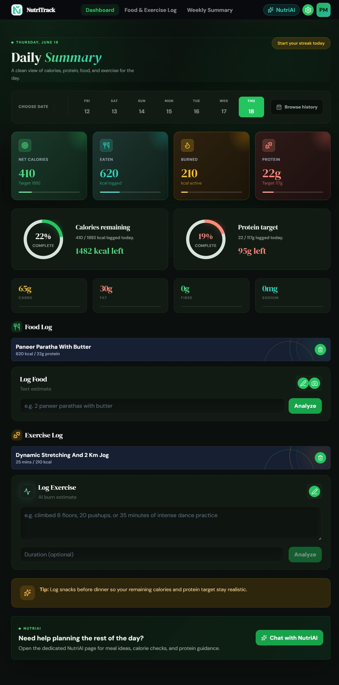
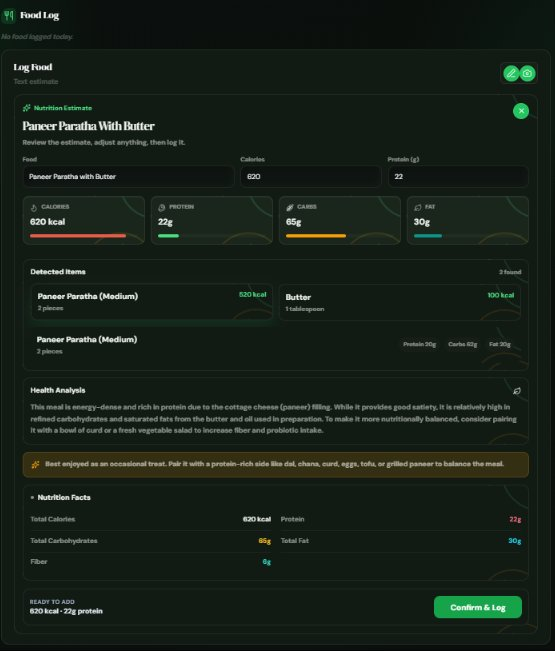
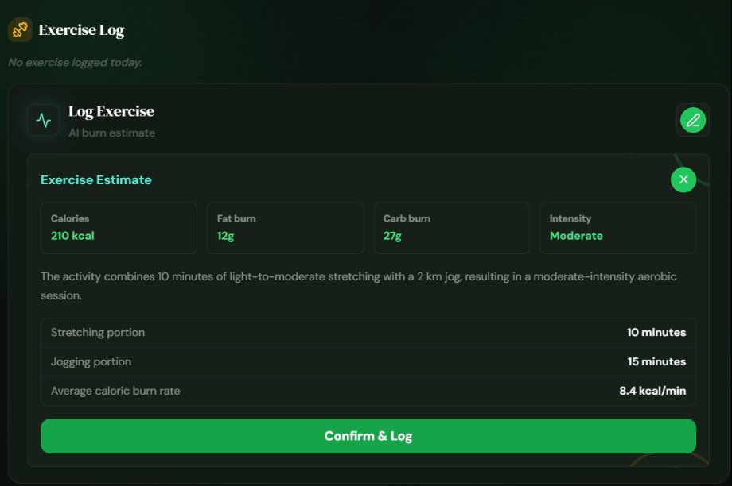
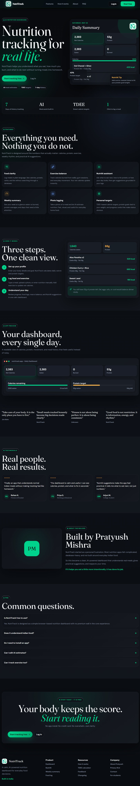
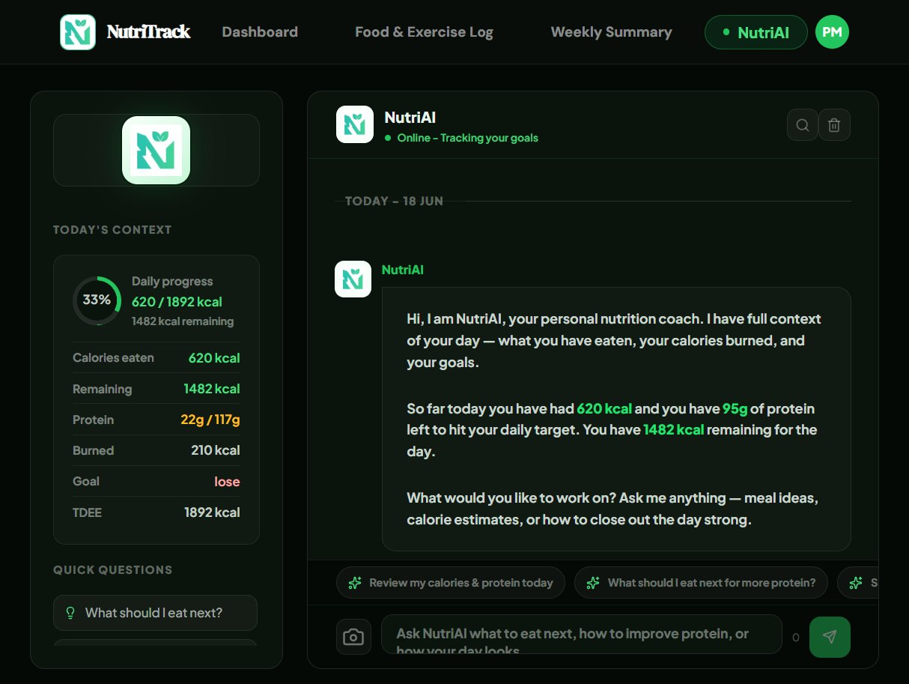
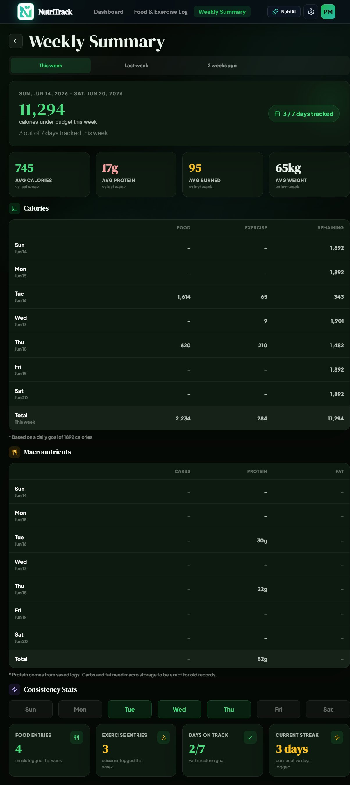
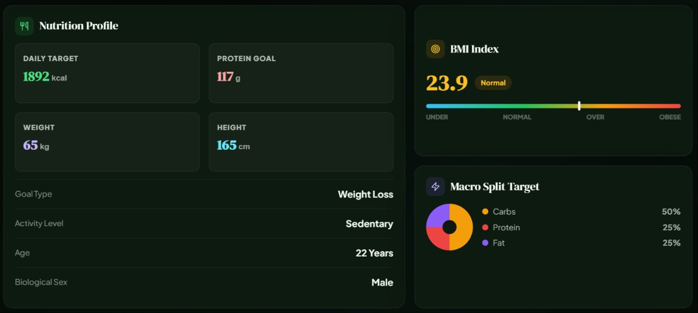

<div align="center">

# 🥗 NutriTrack

**An AI-powered nutrition dashboard that tracks calories, protein, and exercise — without forcing you to search a food database.**

[](https://react.dev/)
[](https://vitejs.dev/)
[](https://nodejs.org/)
[](https://www.prisma.io/)
[](https://www.postgresql.org/)
[](https://ai.google.dev/)
[](LICENSE)

[**Live Demo**](https://nutri-track-sage.vercel.app) · [Report Bug](../../issues) · [Request Feature](../../issues)

</div>

---

## 📖 About

NutriTrack is a full-stack nutrition tracking app built for people who want simple, fast calorie and protein logging without manually searching a food database. Describe a meal in plain text, or snap a photo of it — Gemini AI estimates the nutrition breakdown instantly. An integrated AI assistant, **NutriAI**, then helps you make sense of your daily numbers and plan what to eat next.



## ✨ Features

### 🔐 Authentication & Onboarding
- Email/password signup and login secured with JWT + bcrypt
- Forgot password, reset password, and change password flows (via SendGrid, Resend, SMTP, or Gmail app password)
- Guided onboarding — age, gender, weight, height, activity level, and goal
- Automatic **TDEE calculation** (Mifflin-St Jeor equation) and protein target (`weight_kg × 1.8`)

### 🍽️ Food & Exercise Logging
- Log meals via **text description** or **photo upload**
- Gemini AI estimates calories, protein, carbs, fat, detected food items, and a health analysis — editable before saving
- Client-side image compression before photo analysis
- Exercise logging by description — Gemini estimates calories burned, MET, intensity, and macro burn breakdown

<p float="left">
  
  
</p>

### 📊 Dashboard
- Daily calories eaten, burned, and net calories
- Protein target progress with date selector and full history calendar
- Editable food/exercise log lists with delete actions
- Macro preview cards and a daily AI-generated nutrition tip



### 🤖 NutriAI Chat Assistant
- Context-aware chat that reads your live profile, food logs, and exercise logs for the day
- Reviews your calories/protein, suggests meals, plans remaining meals, and answers "Am I on track?"
- Supports optional image attachments in chat



### 📅 Weekly Summary
- Week selector (this week / last week / 2 weeks ago)
- Calorie table, protein totals & averages
- Tracked days, days on target, and entry counts
- Current streak tracking



### 👤 Profile & Settings
- Editable profile with BMI calculation and macro split display
- Achievement badges — *First Log, 7-Day Streak, Protein Pro, Muscle Builder, Goal Crusher*, and more
- Configurable data retention (forever / 1 year / 1 month) and unit display
- Account deletion



## 🛠️ Tech Stack

| Layer | Technology |
|---|---|
| **Frontend** | React 19, Vite, React Router, Axios, Tailwind CSS, custom CSS design system, Lucide Icons, date-fns |
| **Backend** | Node.js, Express 5, Prisma ORM |
| **Database** | PostgreSQL |
| **AI** | Google Gemini (`gemini-3.1-flash-lite`) via `@google/generative-ai` |
| **Auth** | JWT + bcrypt |
| **Email** | Nodemailer (+ optional SendGrid / Brevo / Resend) |
| **Deployment** | Vercel (frontend) |

## 🏗️ Architecture

A simple two-tier monorepo:

```
NutriTrack/
├── backend/                 # Express REST API
│   ├── prisma/
│   │   └── schema.prisma    # Database schema & migrations
│   └── server.js
└── frontend/                # React + Vite SPA
    └── src/
```

**Core database models:** `User`, `Profile`, `FoodLog`, `ExerciseLog`, `UserSettings`

**Third-party APIs:** Google Gemini (text & photo food analysis, exercise estimation, NutriAI chat). No external nutrition database (USDA/Edamam/Spoonacular) is used — all estimates are AI-generated.

## 🚀 Getting Started

### Prerequisites
- Node.js installed
- A PostgreSQL database (e.g. [Neon](https://neon.tech) or [Supabase](https://supabase.com))
- A [Gemini API key](https://ai.google.dev/)

### 1. Start the Backend

Open a terminal in the project root, then run:

```bash
cd backend
npm.cmd install
node server.js
```

The backend should start on:

```
http://127.0.0.1:5000
```

Verify it by opening that URL — expected response:

```
NutriTrack API is running
```

### 2. Start the Frontend

Open a **second terminal** in the project root, then run:

```bash
cd frontend
npm.cmd install
npm.cmd run dev
```

The frontend should start on:

```
http://127.0.0.1:5173
```

Open that URL in your browser to use the app.

> **Windows PowerShell users:** if you see `npm.ps1 cannot be loaded because running scripts is disabled on this system`, use `npm.cmd` instead of `npm` for all commands (`install`, `run dev`, `run build`, `run lint`).

### 3. Configure Environment Variables

Create or update `backend/.env` before running the backend:

```env
DATABASE_URL="your_database_url"
DIRECT_URL="your_direct_database_url"
JWT_SECRET="your_jwt_secret"
GEMINI_API_KEY="your_gemini_api_key"
```

> Restart the backend after changing `.env`.

## 🧰 Useful Commands

| Command | Description |
|---|---|
| `cd backend && node server.js` | Start backend |
| `cd frontend && npm.cmd run dev` | Start frontend dev server |
| `cd frontend && npm.cmd run lint` | Lint frontend |
| `cd frontend && npm.cmd run build` | Frontend production build |

## 📱 Sharing Online With ngrok

For testing on your phone, run both servers first.

**Terminal 1 — Backend:**
```bash
cd backend
node server.js
```

**Terminal 2 — Frontend (exposed to network):**
```bash
cd frontend
npm.cmd run dev -- --host 0.0.0.0
```

**Then expose the frontend:**
```bash
ngrok http <PORT_NUMBER>
# example: ngrok http 5173
```

Open the `https://...ngrok-free...` URL on your phone.

> **Notes:**
> - For local phone testing, no code changes are needed.
> - `frontend/.env` usually isn't needed for local ngrok testing, since Vite proxies `/api` to `http://localhost:5000`.
> - If you create or edit `frontend/.env`, restart the frontend server.

## ☁️ Frontend API URL For Production

For real deployment, create `frontend/.env` or set the platform environment variable:

```env
VITE_API_URL=https://your-backend-domain.com
```

**Do not** add `/api` at the end.

✅ **Correct:**
```env
VITE_API_URL=https://your-backend-domain.com
```

❌ **Wrong:**
```env
VITE_API_URL=https://your-backend-domain.com/api
```

> If frontend and backend are hosted on the same domain with `/api` routes or rewrites, `VITE_API_URL` can be left empty.

## ⚠️ Known Limitations

- AI nutrition estimates are approximate and **not medically precise** — not a substitute for professional dietary advice.
- Rich AI-generated macro details (full breakdowns, health analysis) are cached in browser `localStorage`, not the database — they aren't yet durable across devices.
- No external verified nutrition database is used; all estimates come from Gemini.
- No OAuth/social login — email & password only.
- Theme system is scaffolded, but there's no functional light/dark toggle yet (dark mode only).
- Some settings/privacy controls in the Settings page are currently placeholders.

## 📄 License

This project is licensed under the MIT License — see the [LICENSE](LICENSE) file for details.

---

<div align="center">

Built by [Pratyush Mishra](https://github.com/pratyushm206)

</div>
